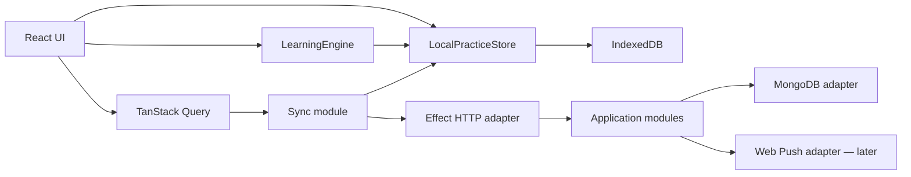

# little tables — product and technical plan

Status: proposed implementation plan  
Date: 2026-07-12  
Product: an iPhone-first, offline-capable PWA for building multiplication fluency

## 1. Product outcome

The first release should help one learner become accurate and quick on multiplication facts from 1×1 through 10×10 while making each visit feel like a small reward, not homework.

The core promise is:

> Open the app, get a tiny win in about 90 seconds, grow the garden, and leave feeling good.

The first release is successful when the learner voluntarily returns, completes short sessions, and measurably improves both recall accuracy and response time on previously weak facts.

### Product principles

1. **One obvious action.** Opening the app should lead to practice in one tap.
2. **Short by design.** A normal session contains 10 questions or runs for about 90 seconds, whichever comes first. A question already on screen is never cut off.
3. **No shame mechanics.** No lost hearts, broken streaks, public rankings, punishment, or red failure screens.
4. **Reward effort and mastery.** Flowers come from completing practice and reaching durable fluency milestones, not from random loot.
5. **Stimulating, not frantic.** Immediate motion, sound, progress, and novelty are used in short bursts. The question itself stays visually calm.
6. **Offline is normal.** Practice must work in airplane mode and survive the app being suspended or killed.
7. **Adult-cute.** The visual treatment can be playful without looking like a preschool worksheet.

## 2. Release scope

### MVP includes

- Private invite onboarding for one learner.
- Install guidance for iPhone Home Screen.
- Multiplication facts 1–10.
- A short initial calibration session.
- Adaptive 10-question practice sessions.
- Four-choice answers with good distractors.
- Immediate, gentle correction.
- Correctness and response-time mastery tracking.
- Home, practice, celebration, garden, and simple stats screens.
- Offline practice and later synchronization.
- A small set of high-quality character animations.
- Sound on/off and reduced-motion support.
- First-party product and learning metrics.

### Deliberately not in MVP

- 11 and 12 tables; these become the first bonus pack after 1–10 is stable.
- Division, addition, subtraction, fractions, or algebra.
- Social features, leaderboards, chat, or user-generated content.
- Subscriptions, payments, ads, coins, gems, or consumable lives.
- Runtime AI calls. GPT Image is a development-time asset tool only.
- Push notifications. The app earns the right to ask after the core loop proves useful.
- A general-purpose content-management system.

## 3. Learning design

### Fact identity

The system stores a multiplication fact canonically as `min(a,b):max(a,b)`, so 7×8 and 8×7 contribute to the same underlying mastery. Presentation orientation is still tracked, allowing the scheduler to show both forms and detect orientation-specific hesitation.

This yields 55 unique facts for 1–10 instead of pretending all 100 ordered expressions are unrelated.

### Session composition

A session is assembled locally so it works offline. The selection score combines:

- due review;
- low mastery;
- slow correct answers;
- recent mistakes;
- one or two new facts;
- orientation variety;
- anti-repetition rules;
- a small confidence-building allocation of already fluent facts.

Initial table order should usually favor 2, 5, and 10, followed by 3, 4, 6, 7, 8, and 9. The calibration session can skip material already recalled fluently. Tables 1 and trivial identities are used sparingly rather than consuming a large part of practice.

### Mastery model

Do not begin with a black-box ML model. Use a deterministic, versioned model that can be tested and explained. Each canonical fact keeps:

- `state`: `unseen | learning | familiar | fluent`;
- `stabilityDays`;
- `difficulty`;
- `dueAt`;
- `correctStreak`;
- `lapseCount`;
- exponentially weighted accuracy;
- exponentially weighted correct-response latency;
- orientation-specific attempt summaries.

The update function considers correctness first and latency second. A quick wrong answer never counts as progress. A correct but slow answer is learning evidence, not failure. Fluent status requires correct recall across separated sessions, not a single lucky streak.

The exact coefficients are configuration data with an `algorithmVersion`. Start with conservative heuristics, then tune from observed sessions without rewriting stored attempts.

Required invariants:

- an incorrect answer never increases stability;
- a correct answer never increases lapse count;
- due dates remain finite and ordered;
- one session cannot take an unseen fact directly to fluent;
- replaying the same event ID has no effect;
- reducing the same ordered event stream always gives the same snapshot.

### Distractor generation

Wrong choices are generated deterministically from common multiplication errors:

- adjacent factor products, such as 7×7 or 7×9 for 7×8;
- nearby multiples of either factor;
- digit reversals when plausible;
- small arithmetic offsets used only as a fallback.

The generator must always return four distinct, non-negative integer choices, include exactly one correct answer, shuffle positions fairly, and avoid absurd options that make guessing effortless.

### Mistake experience

On a mistake:

1. The selected tile gives a soft lateral motion; it does not flash red.
2. The correct tile is revealed.
3. The equation is read visually as `7 × 8 = 56`.
4. After repeated misses, an optional visual model shows seven groups of eight rather than another paragraph of explanation.
5. The fact returns later in the session, separated by other questions.

### Garden economy

Rewards are deterministic:

- one small bloom for completing a normal session;
- special flowers for table-level mastery milestones;
- pots and garden areas for sustained practice totals;
- no reward is removed after inactivity;
- duplicate rewards are impossible because unlock IDs are derived from milestone IDs.

## 4. Complete feature system

The feature set is organized around three layers:

1. **Learn efficiently:** retrieval, spacing, interleaving, correction, and fluency measurement.
2. **Feel good immediately:** responsive feedback, achievable sessions, visible progress, and character warmth.
3. **Want to return:** collection, gentle ritual, novelty, and personal meaning.

Every entertainment feature must reinforce at least one of these layers. If it delays the next useful retrieval, creates anxiety, or becomes more important than learning, it does not ship.

### 4.1 Soft onboarding

**Learner problem:** A conventional placement test feels like school and creates an early exit point.

**Experience:**

- Screen 1 asks only for a preferred name.
- Screen 2 offers sound and motion preferences with a live preview.
- Screen 3 says “let’s find your cozy starting spot” and begins an eight-question calibration disguised as a normal mini-session.
- Install guidance appears after the first tiny win, not before any value has been delivered.

**Learning behavior:** The calibration samples easy anchors, medium facts, and commonly difficult facts. It estimates only a starting state; it does not label the learner or claim a precise ability score.

**Entertainment:** Miffy carries an empty pot through onboarding; the first completed calibration grows its first flower.

**Guardrails:** No age, grade, “bad at math,” percentage score, or comparison with other people. The learner can skip calibration, in which case all facts begin unseen.

**MVP acceptance:** A first-time user reaches a real question within 30 seconds and receives a flower within two minutes.

### 4.2 Home: one-tap tiny win

**Learner problem:** Short attention means any decision or dashboard can become an exit.

**Experience:** The home screen has one dominant action: `play 90 sec`. Beneath it are a small daily progress row, the current garden moment, and navigation. The CTA copy can rotate gently—“ready for a tiny win?”, “a little practice?”, “grow one bloom?”—without changing its location.

**Learning behavior:** The CTA always launches the scheduler’s best mixed session. Specialized modes remain secondary.

**Entertainment:** The home character uses a quiet rotating pose set keyed to time of day and recent progress. Tapping the character triggers one short, non-blocking reaction.

**Guardrails:** No feed, infinite scroll, offers, modal on launch, or overdue warning. The page remains useful offline.

### 4.3 The standard 90-second session

**Learner problem:** Long drills exhaust attention and make returning feel expensive.

**Experience:**

- Ten questions maximum.
- About 90 seconds is the target, not a visible deadline.
- One question occupies almost the whole screen.
- Progress appears as ten flower dots.
- The learner can exit at any time; completed answers remain saved.
- The session ends on a success screen instead of automatically starting another.

**Learning behavior:** A normal mix is approximately:

- 50–60% due or weak facts;
- 20–30% current learning frontier;
- 10–20% fluent confidence facts;
- no more than two unseen facts;
- no immediate repetition except an intentional correction step.

The percentages are policy ranges, not hard-coded promises. The scheduler may adjust when few facts exist in a category.

**Entertainment:** Each answer advances the flower-dot row. Correct streak milestones produce small visual escalation at 3, 6, and 10 without turning every answer into a full-screen interruption.

**Guardrails:** No visible timer, speed rank, or failure condition. The last question is allowed to finish even if the target duration has elapsed.

### 4.4 Progressive answer modes

Multiple choice is welcoming, but multiplication fluency ultimately requires recall rather than recognition. The app therefore changes how an individual fact is answered as mastery grows.

#### `choice` mode

- Four large answer tiles.
- Used for unseen and early-learning facts.
- Distractors are plausible enough to require thought.
- Correct location is balanced across sessions.

#### `keypad` mode

- A large custom numeric keypad, not the system keyboard.
- Used for familiar facts and occasional fluent checks.
- Backspace and submit are thumb reachable.
- Input does not auto-submit after two digits, avoiding accidental errors.

#### `mixed recall` mode

- A session combines choice and keypad questions.
- The transition is introduced positively: “you know this one well enough to say it yourself.”
- A learner can choose an accessibility setting to remain in choice mode, but stats label recognition and recall evidence separately.

**Learning behavior:** Facts cannot become fully fluent from choice-only evidence. At least two correct keypad recalls on separate days are required for fluent status.

**Entertainment:** Graduating a fact from choice to keypad unlocks a tiny bud animation. The app frames the harder interaction as growth, not loss of help.

**Guardrails:** No handwriting or voice recognition in the initial release; both add error and privacy friction unrelated to multiplication.

### 4.5 Immediate answer feedback

**Correct answer:**

- The chosen tile presses, fills softly, and gives a short confirmation sound if enabled.
- The equation completes on screen, for example `7 × 8 = 56`.
- A small character reaction may play, with larger reactions reserved for milestones.
- The next button appears immediately and becomes auto-focused for keyboard users.

**Incorrect answer:**

- The selected answer moves gently sideways and returns.
- The correct answer receives a clear outline and check icon.
- The completed equation remains visible long enough to read.
- The learner taps `got it` rather than being forced through an explanation.
- The fact reappears after two to four intervening questions.

**Learning behavior:** Feedback is immediate because the task is factual recall. Error events preserve the chosen distractor, allowing the system to detect systematic misconceptions.

**Guardrails:** No buzzer, harsh color, disappointed character, “wrong,” loss of reward, or sarcastic copy. Reduced-motion mode replaces motion with a static icon and outline.

### 4.6 Visual “show me” explanations

**Learner problem:** Pure memorization is fragile when a fact has no meaning to attach to.

**Trigger:** Available through a `show me` link after a mistake and offered automatically after two recent misses on the same fact.

**Representations:**

1. equal groups;
2. rectangular array;
3. skip-count number line;
4. known-fact bridge, such as `7×8 = 5×8 + 2×8`;
5. commutative partner, such as `8×7 is the same total`.

The first release needs equal groups, array, and one known-fact bridge. Other representations can follow after testing comprehension.

**Interaction:** The explanation is one swipe-free scene with a single idea. Small staged motion builds the groups; the final equation stays visible. The learner then answers the same fact once without distractors changing mid-explanation.

**Entertainment:** Miffy places flowers into rows or pots into equal groups. The illustration is the explanation, not decorative wallpaper.

**Guardrails:** Never show seven separate paragraphs or require watching a long animation. The sequence is skippable, reduced-motion compatible, and under 10 seconds.

### 4.7 Spaced review

**Learner problem:** Correct today does not imply retrievable next week.

**Mechanic:** Each fact receives a due time based on stability and the last result. Early reviews recur within the same or next session; later reviews expand across days. A lapse shortens the interval without resetting all evidence.

**Learner-facing language:** The app never displays algorithmic due counts. It says “a few flowers need water” or simply assembles the right session.

**Entertainment:** A due review is represented as a plant ready for water, not a decaying or dying plant.

**Guardrails:** Nothing withers, disappears, or punishes absence. A backlog is sampled gradually instead of creating a huge overdue queue.

### 4.8 Interleaved practice

**Learner problem:** Finishing a block of 7-times-table questions can create short-term pattern following without flexible recall.

**Mechanic:** Normal sessions mix facts and tables. New facts receive a short initial blocked introduction of at most two closely related items, then enter the mixed pool. This uses interleaving without overwhelming a learner who has no initial representation.

**Entertainment:** Mixed sessions grow a bouquet containing several flower types; focused sessions grow a single-species arrangement.

**Guardrails:** Do not maximize difficulty for its own sake. The scheduler limits consecutive weak facts and inserts confidence items after repeated errors.

### 4.9 Commutativity and fact-family bridges

**Learner problem:** Treating 7×8 and 8×7 as unrelated doubles the apparent burden.

**Mechanic:** When a new orientation appears, the UI can briefly flip an existing array and say “same flowers, turned around.” Mastery is shared canonically while orientation latency remains observable.

**Entertainment:** A rectangular flower bed rotates 90 degrees while the count stays the same.

**Guardrails:** The app still practices both orientations; understanding commutativity is not used to hide an orientation that remains slow.

### 4.10 Error-pattern rescue

**Learner problem:** Repeating the same generic drill does not address systematic mistakes.

**Detected patterns:**

- confusing adjacent multiples;
- reversing digits;
- answering with the sum of factors;
- confusing two similar facts such as 6×7 and 7×8;
- orientation-specific hesitation;
- fast guessing indicated by very short incorrect latency.

**Mechanic:** After enough evidence, the scheduler inserts a two-question rescue pair. Example: it contrasts 6×7 and 7×8 with two arrays, then asks each once using keypad recall.

**Entertainment:** Rescue is presented as “let’s untangle these twins” with two visually distinct flower beds.

**Guardrails:** Pattern labels are internal and probabilistic. The UI never tells the learner she “has a misconception” from one error.

### 4.11 Confidence recovery

**Learner problem:** Several misses in a row can end a session emotionally even if the learner keeps tapping.

**Mechanic:** After two consecutive misses, the scheduler selects one genuinely fluent fact, then one moderately familiar fact, before returning to the weak item. This produces attainable success without pretending the mistake did not happen.

**Entertainment:** The progress dots shift to a soft “little reset” moment; the character offers a flower and the next prompt arrives without commentary.

**Guardrails:** The system does not fabricate praise or mark easy answers as mastery breakthroughs.

### 4.12 Session modes

The primary home CTA always chooses the standard session. Additional modes unlock gradually and live on a secondary sheet.

| Mode | Exact behavior | Learning purpose | Release |
|---|---|---|---|
| `tiny win` | 10 mixed questions or about 90 seconds | Default spaced retrieval | MVP |
| `five quick` | Exactly 5 questions | Very low-energy days and habit continuity | Beta |
| `table focus` | 8 questions from one selected table plus 2 mixed reviews | Initial acquisition or learner choice | MVP |
| `garden rescue` | 5 current weakest/due facts with confidence spacing | Targeted repair | Beta |
| `keypad bloom` | 8 familiar/fluent facts, keypad only | Recall fluency | Beta |
| `calm practice` | No streak display, no sound, reduced motion, unlimited pause | Anxiety/accessibility | MVP setting |
| `bonus bouquet` | 11 and 12 tables after core competency | Expansion without diluting 1–10 | Phase 5 |

Modes are not separate mastery systems. Every answer enters the same event stream and mastery model.

### 4.13 End-of-session celebration

**Experience:**

- A concise headline: “tiny win complete”.
- One learning truth: “7×8 came back faster today” or “two facts are getting familiar.”
- The earned flower or progress toward the next deterministic reward.
- Two actions: `visit garden` and a quiet `one more`.
- Home is always reachable; no countdown automatically starts another session.

**Entertainment:** The full happy-hop or watering animation plays here, where it will not interrupt question flow.

**Learning behavior:** Comparisons are against the learner’s own prior evidence. Claims require enough data and use median/robust latency, not a single unusually fast tap.

**Guardrails:** Do not show a low percentage immediately after effort. Accuracy details live in stats and use neutral language.

### 4.14 The little garden

**Purpose:** Make accumulated learning tangible and emotionally worth returning to.

**Structure:**

- one central garden plot at launch;
- flower families corresponding loosely to table groups;
- pots from session milestones;
- special blooms from durable fluency;
- background details from longer-term totals;
- a collection book showing found and silhouetted future items.

**Interaction:** The learner can rearrange a limited set of pots and choose one featured flower. The garden is not a full decorating simulator in MVP; the initial scene is automatically composed to stay beautiful.

**Reward cadence:**

- micro: visual confirmation per correct answer;
- session: one bloom or watering progress;
- mastery: special flower/pot;
- weekly: garden scene or postcard;
- long-term: new plot or backdrop.

**Novelty system:** A reward may be visually unrevealed until earned, but eligibility and rarity are deterministic. There is no paid or random loot box.

**Guardrails:** Plants never die. Missed days do not damage the garden. Seasonal assets remain obtainable later so there is no fear of missing out.

### 4.15 Gentle rhythm instead of a brittle streak

**Learner problem:** Streaks can motivate at first but make one missed day feel like total loss.

**Mechanic:** Use a seven-day “glow” row. Any practice lights the day; three or more days creates a warm weekly glow. Consecutive days can be acknowledged quietly, but the primary progress object is cumulative and weekly.

**Copy:** “4 day glow” means four active days in the current rolling week, not a chain that breaks at midnight.

**Entertainment:** The home tulip lamp grows brighter across the week, then settles into a permanent garden sparkle milestone.

**Guardrails:** No streak freeze currency, reset-to-zero screen, red missed day, or notification threatening loss.

### 4.16 Collection book

**Experience:** A compact book catalogs flowers, pots, Miffy moments, and mastered table bouquets. Tapping an unlocked item shows when and why it was earned.

**Learning tie:** Table flowers show learner-friendly mastery detail: “8 facts fluent, 2 still growing.” This makes the collection a progress map rather than unrelated cosmetics.

**Entertainment:** Silhouettes create anticipation, while visible milestone text keeps rewards predictable.

**Guardrails:** Keep it finite and curated. Do not create hundreds of filler objects or daily chores.

### 4.17 Character moments and micro-animation

Character motion has three intensity tiers:

- **Ambient:** blink/breathe/peek, low frequency and pausable.
- **Responsive:** tile press, small hop, flower dot fill, under 500ms.
- **Celebratory:** full character scene at session or mastery milestones.

The character never looks disappointed at the learner. Mistake animation communicates “pause and look again,” not judgment.

Motion rotation prevents habituation: each trigger has two or three approved variants selected deterministically from session ID, while reduced-motion mode uses static frames.

### 4.18 Sound design

**Palette:** soft wooden clicks, paper taps, tiny bell/pluck confirmation, watering sound, and a brief bloom flourish. Avoid arcade lasers, casino sounds, loud buzzers, or spoken praise.

**Mechanic:**

- sound begins only after interaction;
- one master toggle plus an optional quieter level;
- audio files are short, normalized, and preloaded only when enabled;
- repeated correct sounds vary subtly or pitch-shift within a narrow authored set;
- incorrect answers use no negative sound.

**Guardrails:** Default is decided with the learner. Sound is never required and respects reduced sensory settings.

### 4.19 Tiny tactile-feeling interactions without haptics

Because iPhone PWAs cannot reliably use vibration, tactile quality comes from visual physics:

- answer tiles depress 2–3px and return;
- progress dots fill with a short squash;
- buttons use immediate pressed states before async work;
- garden objects have tiny drag resistance if rearrangement ships;
- sound transients align precisely with visual contact.

The interaction completes locally; network latency never delays feedback.

### 4.20 Personal encouragement

For a private app made by a partner, a small amount of genuine personal meaning can outperform generic badges.

**Private-beta version:** A build-time pack of five to ten short notes can unlock at non-performance milestones, such as the first week of use or 25 completed sessions. Examples should sound like the actual partner and avoid commenting on intelligence, mistakes, or surveillance.

**Possible later version:** A separate, explicit `send a flower` capability that lets the partner send a note without seeing detailed answer history.

**Guardrails:** No hidden monitoring dashboard, push pressure, or message tied to a bad session. This feature requires the learner’s knowledge and consent before any live connection exists.

### 4.21 Learner-facing progress

Stats answer three questions only:

1. What has grown?
2. What is becoming easier?
3. What should I practice next?

**Screens:**

- table garden: one row per table with `unseen`, `growing`, `familiar`, and `fluent` flowers;
- “getting quicker” card using robust week-over-week latency only when enough comparable data exists;
- total fluent facts;
- weekly practice glow;
- a `practice this table` action.

**Guardrails:** No global percentile, IQ implication, raw event log, or misleading average across mixed difficulty. Avoid calling slow but correct answers wrong.

### 4.22 Optional “today’s bouquet” goal

**Mechanic:** Five petals represent five meaningful retrievals, not necessarily five correct answers. Completing them fills today’s small bouquet and may happen inside one normal session.

**Purpose:** Give a visible near-term finish line without making the whole ten-question session feel long.

**Guardrails:** The daily bouquet does not expire with lost rewards. It resets quietly and does not create a backlog.

### 4.23 Surprise and delight

Small secrets keep the app from feeling mechanically repetitive:

- rare but deterministic character poses after session milestones;
- tapping a garden flower may make it sway or reveal a ladybug;
- occasional alternate end copy;
- time-of-day lighting that remains pale and readable;
- a birthday or personally meaningful garden scene configured locally;
- seasonal palettes that never gate learning content.

**Guardrails:** Surprises are cosmetic, fast, accessible, and never variable-ratio rewards tied to excessive practice.

### 4.24 Healthy stopping design

The app is intentionally not a scroll product.

- A session has a clear end.
- The largest celebration happens at the stopping point.
- `one more` is available but visually secondary.
- After three consecutive sessions, the app suggests visiting the garden or returning later.
- No autoplay, energy meter, endless quest list, or rapidly refreshing reward feed.

The aim is frequent voluntary return, not maximum minutes per visit.

### 4.25 Smart reminders — later

When evidence justifies reminders, the app can offer:

- a preferred time window;
- a maximum frequency;
- copy style selection: gentle, playful, or none;
- `remind me tomorrow` from inside the app;
- automatic quieting after ignored notifications.

Examples: “a tiny flower is ready to grow” or “90 seconds for today’s bouquet?” Avoid “you’re falling behind” and streak-loss threats.

The reminder should deep-link to the ready session and never require navigating a dashboard.

### 4.26 Bonus tables 11 and 12

These unlock as an optional garden gate after the 1–10 loop is working. They use the same mastery model but remain a separate content pack so they do not flood early sessions.

- 11 begins with the visible repeated-digit pattern but still verifies recall.
- 12 uses known-fact bridges, such as `10×n + 2×n`.
- A bonus bouquet and new garden corner provide a clear reason to try them.

### 4.27 Future math expansion

The likely expansion order is:

1. multiplication 11 and 12;
2. inverse division facts linked to mastered multiplication;
3. addition/subtraction fact fluency;
4. fractions or other conceptual modules only after a new interaction design.

Division should reuse multiplication fact families: a mastered `7×8=56` becomes the bridge to `56÷7=8` and `56÷8=7`. It should not be introduced as an unrelated deck.

Do not force conceptual topics into the four-choice multiplication interface. Each new domain must define its own representations and acceptable evidence of mastery.

### 4.28 Feature flags and experiments

All meaningful behavior variations use explicit configuration:

- session length;
- choice-to-keypad threshold;
- scheduler policy version;
- celebration intensity;
- sound default;
- install prompt timing;
- reminder eligibility;
- explanation trigger threshold.

For the one-user beta, changes are observational product tuning, not statistically significant A/B tests. Record configuration versions on events so performance changes can be understood honestly.

### 4.29 Feature priority

#### Must make the first private beta

- soft onboarding and calibration;
- one-tap home;
- standard session;
- choice and keypad modes;
- immediate correction;
- spaced/interleaved scheduler;
- commutative fact model;
- basic visual explanation;
- confidence recovery;
- end celebration;
- garden, weekly glow, and learner progress;
- character motion, sound controls, and reduced motion;
- healthy stopping.

#### Add after the core is stable

- five-question mode;
- error-pattern rescue pairs;
- collection book depth;
- personal encouragement pack;
- more garden rearrangement;
- reminder opt-in;
- 11 and 12 tables.

#### Explicitly reject unless evidence changes

- public leaderboards;
- PvP speed races;
- loot boxes or randomized rarity;
- lost lives/hearts;
- a brittle daily streak;
- infinite quests;
- ads or cross-promotion;
- an AI tutor chat for basic fact practice;
- runtime-generated art or explanations;
- partner surveillance of individual mistakes.

### 4.30 Feature evaluation rubric

Before implementation, every proposed feature receives a 0–2 score on:

- improves retrieval quality;
- improves return motivation;
- reduces anxiety or friction;
- remains clear offline;
- respects a 90-second session;
- can be measured without invasive tracking;
- can be made accessible;
- has acceptable implementation and asset cost.

A feature with no learning or return benefit does not ship. A feature that scores poorly on anxiety, accessibility, or healthy stopping must be redesigned even if it looks engaging.

## 5. Recommended stack

All dependencies should use the latest stable release at project initialization and then be locked in `pnpm-lock.yaml`. Avoid floating versions in CI.

| Concern | Choice | Reason |
|---|---|---|
| Monorepo | pnpm workspaces | Small, fast, and sufficient without adding a build orchestrator initially. |
| Web | React + TypeScript + Vite | Mature PWA toolchain, simple static output, excellent mobile iteration. |
| Routing | TanStack Router | Typed routes without requiring a server-rendering framework. |
| Remote state | TanStack Query | Fetching, cache invalidation, reconnect behavior, and sync status. |
| Durable local state | IndexedDB via Dexie | Sessions and the outbox survive reloads and offline use. |
| Styling | Tailwind CSS | Fast implementation of the approved visual system through semantic design tokens. |
| UI motion | Motion | Buttons, counters, transitions, and reduced-motion-aware micro-interactions. |
| Character motion | dotLottie web runtime | Compact, scalable, inspectable animation assets. |
| PWA | `vite-plugin-pwa` + Workbox | Manifest, precaching, update flow, and explicit runtime caching. |
| Backend runtime | Node.js LTS | Best-supported target for Effect, MongoDB, tests, and deployment. |
| Backend | Effect + `@effect/platform` | Typed errors, schemas, dependency layers, structured concurrency, and HTTP contracts. |
| Database | MongoDB Atlas | Fits append-only attempt events and evolving mastery/reward documents. |
| Validation | Effect Schema | One source of truth for domain, storage, and transport validation. |
| Unit/integration tests | Vitest + fast-check + Testcontainers | Examples, property invariants, and real MongoDB behavior. |
| Browser tests | Playwright | Offline, service-worker, installability, and end-to-end flow tests. |
| Deployment | One Docker image on Railway initially | Same-origin web and API, simple cookies, one deployable, low operational overhead. |

### Why not make TanStack Query the offline database?

TanStack Query supports offline-aware queries and paused mutations, but its cache is not the correct source of truth for learning attempts. Every answer is first committed to IndexedDB as an immutable event. TanStack Query then drives synchronization and canonical server-state reads. A suspended iPhone cannot lose a completed session merely because a mutation cache was not persisted correctly.

### Why one deployable first?

The Effect server serves both `/api/*` and the built Vite application. This gives the PWA, cookies, and API one origin and avoids CORS, duplicated deployments, and cross-site cookie behavior. Static assets use content hashes and long cache headers. The frontend and API can be separated behind a CDN later without changing the domain modules.

## 6. Architecture



The architecture is organized around a few deep modules. UI files do not calculate mastery, invent rewards, write MongoDB queries, or know synchronization rules.

### `LearningEngine`

Pure, shared TypeScript. It hides scheduling, mastery updates, distractors, session state, and reward derivation behind a small interface:

```ts
type LearningEngine = {
  createSession(input: CreateSessionInput): PracticeSession
  answer(input: AnswerInput): AnswerResult
  reduce(input: ReduceAttemptsInput): LearningSnapshot
}
```

`CreateSessionInput` includes a snapshot, session policy, current time, and explicit random seed. `AnswerResult` returns the next immutable session state plus domain events. Time and randomness are inputs, never hidden globals. The same interface is the primary test surface.

### `LocalPracticeStore`

Owns all durable device behavior:

```ts
type LocalPracticeStore = {
  load(): Promise<LocalBootstrap>
  commit(events: ReadonlyArray<DomainEvent>): Promise<void>
  pendingBatch(limit: number): Promise<SyncBatch>
  acknowledge(result: SyncResult): Promise<void>
}
```

Its production adapter uses IndexedDB. Tests use an in-memory adapter. A transaction commits the answer event, current session, updated local snapshot, and outbox entry together.

### `Sync`

Owns batching, retry, idempotency, reconciliation, and connectivity state:

```ts
type Sync = {
  bootstrap(): Promise<CanonicalBootstrap>
  flush(): Promise<SyncSummary>
}
```

It does not leak HTTP or MongoDB concepts to the UI. Retries use capped exponential backoff with jitter. Authentication errors stop retrying and request a new session; network and 5xx errors remain pending.

### Backend application modules

- `AttemptIngestion`: validates and idempotently stores batches.
- `ProgressProjection`: reduces ordered attempts into canonical mastery.
- `RewardGarden`: derives unlocks from progress and completed sessions.
- `Identity`: claims the private invite and manages sessions.
- `Reminder`: stores push subscriptions and sends opt-in reminders later.

The Effect HTTP code is a thin adapter. Because the `HttpApi` area can evolve, imports from unstable platform modules stay inside `apps/server/src/http`; domain and application packages do not depend on them. Package versions are pinned, and upgrades require contract tests to pass.

### Repository layout

```text
little-tables/
  apps/
    web/
      src/app/
      src/features/
      src/pwa/
      src/styles/
    server/
      src/http/
      src/runtime/
      src/config/
  packages/
    domain/          # LearningEngine and schemas; no I/O
    local-store/     # IndexedDB adapter and in-memory test adapter
    contracts/       # Effect Schema HTTP/event contracts
    design-system/   # UI primitives and tokens
    asset-catalog/   # Typed animation/image manifest
  assets/
    references/      # approved private references; gitignored if licensed
    prompts/         # versioned generation specs
    source/          # approved source artwork
    lottie/          # editable/exported animation files
    generated/       # selected generated masters
  tools/
    asset-pipeline/
  docs/
    decisions/
```

## 7. Data design

### Client IndexedDB tables

- `profile`: local profile and settings.
- `attempts`: immutable answer events keyed by event ID.
- `sessions`: resumable active and completed sessions.
- `mastery`: current local fact projections.
- `rewards`: unlocked garden items.
- `outbox`: unsynchronized event IDs and retry metadata.
- `metadata`: schema, algorithm, content, and asset-catalog versions.

### MongoDB collections

#### `profiles`

```ts
{
  _id: ProfileId,
  displayName: string,
  locale: string,
  timezone: string,
  settings: {
    sound: boolean,
    reducedMotion: boolean | "system",
    reminder?: { enabled: boolean, localTime: string }
  },
  createdAt: Date,
  updatedAt: Date
}
```

#### `attempt_events`

```ts
{
  _id: AttemptEventId,       // generated client-side; unique idempotency key
  profileId: ProfileId,
  sessionId: SessionId,
  sequence: number,
  factKey: string,
  shownAs: { left: number, right: number },
  choices: number[],
  selected: number,
  correct: boolean,
  latencyMs: number,
  occurredAt: Date,
  receivedAt: Date,
  algorithmVersion: string,
  contentVersion: string,
  appVersion: string
}
```

Indexes: unique `_id`; unique `{profileId, sessionId, sequence}`; `{profileId, occurredAt}`; `{profileId, factKey, occurredAt}`.

#### `learning_snapshots`

One latest snapshot per profile, with `throughEvent`, `algorithmVersion`, fact summaries, session totals, and update time. It is a rebuildable projection, not the source of truth.

#### `reward_unlocks`

One document per deterministic unlock ID with a unique `{profileId, milestoneId}` index.

#### `web_push_subscriptions` — later

Encrypted endpoint and keys, user timezone, opt-in timestamp, last-send time, and revocation state.

### Consistency model

Attempt events are the source of truth. Batch ingestion uses event IDs for idempotency. The server stores accepted events, updates the projection, and returns a canonical snapshot. If projection update fails after event insertion, it is retried or rebuilt; no learning data is lost.

Do not put all writes into a multi-document transaction by default. Idempotent event ingestion plus rebuildable projections is simpler and more robust for this workload. Use a transaction only if a later invariant genuinely requires atomic changes across documents.

### Schema evolution

- Every persisted event includes content and algorithm versions.
- IndexedDB migrations are explicit and tested against fixture databases.
- MongoDB documents are decoded through Effect Schema; invalid documents fail with tagged errors rather than silently becoming `any`.
- Projection rebuilds support old event versions through small version-specific decoders.

## 8. HTTP interface

All request and response bodies use Effect Schema and tagged error responses.

| Method | Path | Purpose |
|---|---|---|
| `POST` | `/api/v1/invites/claim` | Exchange the one-time invite for a secure session. |
| `POST` | `/api/v1/session/refresh` | Rotate an expiring session. |
| `POST` | `/api/v1/session/logout` | Revoke the current session. |
| `GET` | `/api/v1/bootstrap` | Profile, canonical snapshot, rewards, settings, and version config. |
| `POST` | `/api/v1/attempts/sync` | Idempotently accept an ordered batch and return acknowledgements plus canonical progress. |
| `PATCH` | `/api/v1/settings` | Update learner preferences. |
| `POST` | `/api/v1/push-subscriptions` | Add an opted-in subscription in the later reminder phase. |
| `DELETE` | `/api/v1/push-subscriptions/:id` | Revoke a subscription. |
| `GET` | `/health/live` | Process liveness. |
| `GET` | `/health/ready` | Database and required configuration readiness. |

The sync response includes accepted, duplicate, and rejected event IDs separately. One malformed event does not make the client retry an otherwise accepted batch forever.

## 9. Authentication, privacy, and security

### Initial private release

1. Generate one high-entropy, single-use invite URL on the server.
2. Opening it exchanges the token for a short-lived session plus rotating refresh session.
3. Store credentials only in `Secure`, `HttpOnly`, `SameSite=Lax` cookies.
4. Store only a hash of the invite and refresh token server-side.
5. Rate-limit invite, refresh, and sync endpoints.
6. Keep the app and API same-origin and require an origin/CSRF check for state-changing requests.

Do not store bearer tokens in `localStorage` or IndexedDB.

### Data minimization

- No contacts, location, photo library, advertising IDs, or social graph.
- Display name can be a nickname.
- Attempt telemetry exists to power learning; it is not sold or sent to ad platforms.
- Logs exclude answers, cookies, push keys, and invite tokens.
- Provide export and delete scripts before inviting more users.
- Keep `OPENAI_API_KEY` in developer/CI secrets only. It is never shipped to the PWA and is not required by the production app.

### Character intellectual property

Miffy is protected character artwork. Exact Miffy assets are acceptable only for a private prototype with appropriately sourced references. Any public, commercial, broadly shared, or App Store release requires a license from the rights holder or replacement with an original rabbit identity. Treat this as a release gate, not a footer disclaimer.

## 10. PWA and iPhone plan

### Manifest and shell

- `display: "standalone"`, stable manifest `id`, start URL, theme colors, and portrait orientation.
- Maskable icons plus explicit Apple touch icons.
- Safe-area CSS using `env(safe-area-inset-*)`.
- Viewport behavior tested with keyboard, Dynamic Island devices, and landscape rotation even if portrait is preferred.
- A friendly in-app install walkthrough; iOS install cannot be forced.

### Service-worker policy

Use a custom Workbox `injectManifest` worker because sync and update behavior are product-critical.

- Precache the hashed app shell, fonts, core animation files, and essential garden art.
- `CacheFirst` for immutable hashed visual assets.
- `StaleWhileRevalidate` for non-critical content catalog files.
- `NetworkFirst` with a short timeout for bootstrap reads.
- Never cache authentication responses or sync POST responses.
- Show an “update ready” prompt between sessions; never replace the app mid-question.
- Keep the previous shell viable until the new worker activates successfully.

### Offline behavior

- First successful load downloads the core shell and starter assets.
- Every answer commits locally before the next question renders.
- A visible but quiet status says `saved on this phone` or `synced`.
- Reconnect triggers `Sync.flush()`; foregrounding the app also attempts a flush.
- The learner can complete multiple sessions offline.
- Canonical reconciliation never removes earned local feedback while a session is in progress.

### iPhone-specific constraints

- Do not depend on the Vibration API for haptics; it is not a reliable iPhone PWA capability. Use motion and optional sound for feedback.
- Audio begins only after user interaction and respects mute settings.
- Web Push is a later enhancement. On iPhone it requires a Home Screen web app, an explicit user gesture, and granted permission.
- Web storage can be constrained or cleared; server synchronization is the backup for learning history.
- Playwright WebKit is useful but is not a substitute for testing a real iPhone Home Screen installation.

## 11. Design system and accessibility

### Tokens

Implement the approved palette as semantic CSS variables exposed to Tailwind:

- `--surface-canvas`: warm cream;
- `--surface-card`: white;
- `--surface-soft`: petal pink;
- `--action-primary`: blush pink;
- `--ink-primary`: near black;
- `--accent-red`, `--accent-yellow`, `--accent-blue`, `--accent-green`.

Avoid scattering raw hex values through feature code. Typography, radii, shadows, spacing, and motion durations also receive semantic tokens.

### UI primitives

Build a small set only when used:

- `PrimaryButton`;
- `AnswerTile`;
- `ProgressDots`;
- `CharacterScene`;
- `RewardChip`;
- `BottomNav`;
- `Sheet`;
- `Toast`;
- `SyncStatus`.

### Accessibility requirements

- WCAG 2.2 AA contrast for text and controls.
- Minimum 44×44 CSS pixel tap targets, with answer tiles substantially larger.
- Visible focus styles and complete keyboard operation.
- Math prompts have screen-reader labels such as “seven times eight”.
- Correctness is never communicated by color alone.
- `prefers-reduced-motion` disables bounce, shake, parallax, and confetti while retaining instant state changes.
- Sound is optional and never carries required information.
- No visible countdown by default; time contributes to adaptation without creating pressure.
- The app supports Dynamic Type-like browser text enlargement without clipping the answer grid.

## 12. Image and animation production

### Asset rule

Generate art at development time, review it, optimize it, and commit approved outputs. Never generate character art during a learner session.

### GPT Image pipeline

Use the Image API with `gpt-image-2` for one-shot generation and edits. Lock approved production generations to the dated snapshot `gpt-image-2-2026-04-21`; update deliberately after a visual regression review.

The source of truth for each asset is a manifest entry:

```ts
{
  id: "miffy-celebrate-master",
  kind: "character-master",
  model: "gpt-image-2-2026-04-21",
  promptFile: "assets/prompts/miffy-celebrate.md",
  references: ["assets/references/approved-character-sheet.png"],
  output: "assets/generated/miffy-celebrate-master.png",
  status: "approved",
  sha256: "...",
  notes: "front-facing; pink dress; no shadow"
}
```

Pipeline commands:

- `pnpm assets:draft <id>` — low-quality draft iterations;
- `pnpm assets:render <id>` — high-quality candidate from the versioned prompt;
- `pnpm assets:prepare <id>` — background removal, crop, color conversion, and WebP/PNG outputs;
- `pnpm assets:check` — dimensions, file size, alpha, hashes, naming, and missing catalog entries;
- `pnpm assets:approve <id>` — human selection recorded in the catalog.

`gpt-image-2` always uses high-fidelity image inputs; do not send an unsupported `input_fidelity` option. It currently does not produce transparent backgrounds, so request a perfectly flat chroma-key background absent from the character, remove it locally, and inspect edge quality at 4× zoom. Prefer PNG masters and WebP delivery files. Generate UI text in HTML, never inside character images.

### Consistency workflow

1. Create one approved character sheet containing front, 3/4, side, palette, line weight, dress shape, face placement, and scale rules.
2. Feed that sheet into every character edit/generation.
3. Generate pose masters one at a time rather than asking for a crowded sprite sheet.
4. Reuse an accepted pose as the edit input for nearby poses.
5. Lock palette values during post-processing.
6. Reject candidates with changed eye spacing, mouth geometry, ear proportions, line weight, or limb count.
7. Keep a contact sheet of every approved pose for visual regression review.

### Recommended animation pipeline: GPT Image → vector cleanup → Lottie Creator MCP

Do not ask GPT Image to generate final SVG or ask a language model to invent all paths from scratch.

1. Generate and approve a clean high-resolution pose master.
2. Reconstruct only the needed character parts as simple named vector layers: `head`, `ear_left`, `ear_right`, `body`, `arm_left`, `arm_right`, `leg_left`, `leg_right`, and props. This can be traced in Lottie Creator or a vector editor; preserve slight human irregularity rather than auto-tracing thousands of points.
3. Install the official Lottie Creator MCP for Codex and the LottieFiles motion-design skill.
4. Import the approved layered SVG/image into Lottie Creator.
5. Use MCP operations to set anchors, masks, keyframes, cubic-bezier easing, timing, and variants.
6. Export `.lottie` plus JSON source, run Lottie validation, and render a frame strip for review.
7. Test at actual iPhone size, on low-power mode, and with reduced motion.

The LottieFiles MCP can create and edit layers, paths, strokes, masks, transforms, and keyframes, but its own best practice is to begin from approved artwork. This gives the agent control over motion while the source art protects character fidelity.

### Initial motion inventory

Keep the first set small and reusable:

| Animation | Trigger | Duration | Loop |
|---|---|---:|---|
| `idle-breathe` | Home and question peek | 2.4–3.2s | Yes, subtle |
| `tulip-offer` | Home entrance | 700ms | No |
| `peek` | New question | 450ms | No |
| `happy-hop` | Correct streak milestone | 650–850ms | No |
| `gentle-encourage` | Mistake | 500ms | No |
| `water-flower` | Garden reward | 1.2–1.6s | No |
| `new-bloom` | Unlock | 700–900ms | No |

Most correct answers should use lightweight CSS motion plus a small character reaction; playing the largest celebration ten times per session would become slow and irritating.

### Fallback ladder

1. dotLottie animation.
2. Reduced-motion static final frame.
3. Optimized static WebP/PNG if the runtime fails.

The UI must never block on a decorative asset.

## 13. Notifications

Notifications are phase 5, after voluntary usage is understood.

- Ask only after at least three completed sessions and from a clear user tap.
- Explain the exact value before the browser permission prompt.
- Default to no more than one reminder per local day.
- Avoid guilt copy and streak-threat language.
- Respect timezone, quiet hours, Focus, revoked subscriptions, and repeated non-engagement.
- Stop automatically after several ignored reminders and let the learner re-enable them.
- Use standards-based Web Push and feature detection.

## 14. Observability and metrics

### Product metrics

- sessions started and completed;
- questions per completed session;
- voluntary sessions per week;
- return on the next day and within seven days;
- install funnel completion;
- sound and reduced-motion choices;
- notification opt-in and disable rate when notifications ship.

### Learning metrics

- accuracy on due reviews;
- median correct latency by fact and table;
- number of fluent facts;
- lapse rate after a fact becomes fluent;
- weak-fact improvement across separated days;
- calibration versus later performance.

### Operational metrics

- sync age and outbox size;
- rejected events by schema version;
- API latency and tagged error rates;
- service-worker version distribution;
- asset load failures;
- projection lag.

Use structured Effect logs with correlation IDs and aggressive field allow-listing. Start without a third-party behavioral analytics SDK; derive the required metrics from first-party domain events.

## 15. Testing strategy

### Domain tests

- Example tests for known session and mastery transitions.
- Property tests for the mastery and distractor invariants.
- Seeded scheduler snapshot tests.
- Event replay and idempotency tests.
- Algorithm-version fixture tests so tuning cannot rewrite history accidentally.

### Local-store tests

- Real IndexedDB tests using a browser environment.
- Atomic answer/session/outbox commit.
- Refresh and process-kill recovery.
- Multiple offline sessions followed by ordered sync.
- IndexedDB migration fixtures from every released schema.

### Backend tests

- HTTP contract tests through the Effect HTTP interface.
- MongoDB integration tests against Testcontainers, not mocked driver calls.
- Duplicate, partial rejection, out-of-order, and large batch ingestion.
- Projection rebuild equivalence.
- Auth token rotation, replay rejection, expiry, rate limit, and CSRF/origin checks.

### End-to-end tests

- Claim invite → installable shell → calibration → session → garden reward.
- Offline reload → complete session → reconnect → sync.
- Update becomes available during a question and waits until session end.
- Reduced-motion and sound-off journeys.
- 320px-wide layout, text zoom, keyboard navigation, and screen-reader labels.
- Service-worker cache and offline fallback behavior.

### Visual and asset tests

- Screenshot tests for core screens at representative iPhone viewports.
- Frame-strip snapshots for every animation.
- Automated asset budget, alpha, dimensions, and catalog checks.
- Human approval for character fidelity; this is not delegated to a pixel-diff threshold.

### Physical-device release check

Before each release, test on the girlfriend’s actual iPhone:

- install and launch from Home Screen;
- safe areas and keyboard;
- offline practice;
- resume after locking the phone;
- audio after mute/unmute;
- animation smoothness and reduced motion;
- update prompt;
- sync after reconnect;
- actual appeal and comprehension.

## 16. CI/CD and environments

### Required checks

1. formatting;
2. lint;
3. TypeScript project references;
4. unit and property tests;
5. MongoDB integration tests;
6. production build;
7. Playwright critical path;
8. asset catalog and size-budget checks;
9. dependency and secret scan;
10. container health check.

### Environments

- `local`: local MongoDB container and in-memory adapters where useful.
- `preview`: isolated database name and private invite per branch/deploy.
- `production`: protected secrets, backups, alerts, and manual promotion.

Database indexes are declared in code and verified at startup/readiness. Production migrations are additive first; destructive cleanup happens only after a compatible release has been stable.

### Deployment and rollback

- Build one immutable Docker image containing the Effect server and Vite output.
- Run as a non-root user with a read-only filesystem except explicit temp space.
- Expose liveness and readiness separately.
- Deploy only after tests and a preview smoke test.
- Keep the prior image available for immediate rollback.
- Service-worker updates remain backward-compatible with at least the previous API and local schema during rollout.
- MongoDB Atlas point-in-time backup is enabled before inviting additional users.

## 17. Delivery phases and exit criteria

### Phase 0 — product calibration and foundations

Deliverables:

- Confirm preferred name/copy, sound preference, and whether exact Miffy use remains private.
- Record the visual tokens and approved prototype screens.
- Create repository, formatting, TypeScript, CI, environment validation, and decision records.
- Implement the domain schemas and a command-line simulation of sessions.

Exit criteria:

- The simulated scheduler produces sensible sessions for unseen, weak, and fluent profiles.
- Mastery and distractor invariants pass property tests.
- The MVP list is accepted and unchanged work has a place in the backlog.

### Phase 1 — tracer-bullet PWA

Deliver one thin, end-to-end slice:

- private invite;
- installable home screen;
- one real practice session;
- durable IndexedDB event commit;
- sync to MongoDB through Effect;
- one garden reward;
- deployment to a private URL.

Use temporary static character art here so asset production does not block architecture.

Exit criteria:

- The complete slice works online and in airplane mode on the real iPhone.
- Killing and reopening the PWA resumes or safely closes the session without losing answers.
- Duplicate sync creates no duplicate attempt or reward.

### Phase 2 — complete learning loop

Deliverables:

- calibration;
- full 1–10 content;
- adaptive scheduling;
- mastery projection;
- repeated-miss teaching aid;
- garden milestone system;
- simple stats;
- first-party learning metrics.

Exit criteria:

- Scheduler behavior passes all domain fixtures.
- Every multiplication fact and distractor combination is valid.
- Projection rebuild matches incremental projection.
- The learner can understand progress without explanation from the developer.

### Phase 3 — visual and motion production

Deliverables:

- approved character sheet;
- generated pose masters;
- Lottie Creator MCP setup;
- seven initial animations;
- app icons, empty states, flowers, pots, and garden art;
- reduced-motion/static fallbacks;
- optimized asset bundles and catalog.

Exit criteria:

- Character proportions and line treatment are approved across every pose.
- No core screen waits for animation.
- Initial app shell plus core above-the-fold assets meet the agreed performance budget.
- Motion remains smooth on the actual phone and is comfortable after repeated sessions.

### Phase 4 — polish and private beta

Deliverables:

- full accessibility pass;
- copy and sound tuning;
- service-worker update UX;
- recovery, export, and deletion scripts;
- operational dashboards and alerts;
- two weeks of private usage observation.

Exit criteria:

- No high-severity accessibility, offline, data-loss, or auth issue is open.
- A session can be completed from a cold Home Screen launch without network.
- The learner voluntarily returns often enough to justify notification work.

### Phase 5 — retention enhancements

Only after evidence from the beta:

- opt-in Web Push;
- reminder timing controls;
- garden content expansion;
- 11 and 12 bonus tables;
- additional session modes such as weak-fact rescue or table focus.

Exit criteria:

- Reminder opt-in is contextual and reversible.
- Retention improves without increased annoyance or notification disablement.
- Bonus content does not dilute mastery of 1–10.

### Phase 6 — broader learning platform

Before adding new operations, generalize only the content seams that actually vary:

- operation/content pack;
- prompt renderer;
- answer evaluator;
- mastery policy;
- teaching representation;
- reward theme.

Do not build this abstraction during the multiplication MVP. One adapter is a hypothetical seam; multiplication plus a second real content pack will show the correct interface.

## 18. Risks and mitigations

| Risk | Mitigation |
|---|---|
| Cute app, weak learning value | Track latency and spaced recall, not taps; keep LearningEngine deterministic and tested. |
| Novelty wears off | Short sessions, meaningful progression, content variation, and observation of voluntary return. |
| iOS suspends the app mid-write | Commit each answer atomically to IndexedDB before advancing. |
| TanStack cache is mistaken for durable storage | IndexedDB is explicitly the local source of truth; Query coordinates remote state only. |
| Duplicate or reordered sync | Immutable client event IDs, sequence constraints, idempotent ingestion, rebuildable projection. |
| Effect HTTP modules change | Pin dependencies and isolate platform imports inside the HTTP adapter. |
| Generated character inconsistency | Approved reference sheet, edit-based workflow, dated model snapshot, human review, contact-sheet regression. |
| Messy SVG/Lottie output | Start from cleaned named layers; use MCP for animation rather than source-art invention. |
| Animation bundle becomes heavy | Small inventory, dotLottie compression, lazy load non-core garden scenes, static fallbacks. |
| Miffy licensing blocks public launch | Treat exact art as private-prototype-only and decide license versus original mascot before public distribution. |
| Notifications become manipulative | Delay them, cap frequency, use opt-in controls, stop after ignored reminders, never threaten progress. |
| One-user assumptions leak into architecture | Use profile IDs and idempotent events now, but avoid multi-tenant administration until needed. |

## 19. Definition of done for MVP

The MVP is done only when all of the following are true:

- It installs and launches standalone on the target iPhone.
- A first-time learner can reach the first question without developer help.
- A full session works without a network connection.
- Every answer is durable before the next question appears.
- Reconnection syncs idempotently and restores the same canonical progress.
- All 1–10 facts can be scheduled and answered with valid choices.
- Mastery uses accuracy, latency, and spaced evidence.
- Rewards are deterministic and cannot be lost through inactivity.
- The approved visual system and core character motions are implemented with reduced-motion fallbacks.
- Sound can be disabled and no required feedback depends on sound, color, or motion alone.
- No critical accessibility, auth, privacy, data-loss, or offline defect remains.
- The learner has used the private beta long enough to confirm that the app is appealing in practice, not only in a mockup.

## 20. Decisions to confirm before implementation

These do not block architecture work, but they must be resolved before the relevant phase:

1. Is the initial deployment strictly private, or is public sharing expected soon? This decides the Miffy licensing deadline.
2. What nickname should appear in the interface?
3. Should correct answers use a soft sound by default, or begin muted?
4. Should a normal session be fixed at 10 questions, or offer both 5-question and 10-question snacks?
5. Is Railway + MongoDB Atlas acceptable for the private beta, or is there an existing hosting preference?

## 21. Primary technical references

- [Meta-analytic review of spacing and retrieval practice for mathematics learning](https://eric.ed.gov/?id=EJ1478558)
- [Why interleaving improves math learning](https://pubmed.ncbi.nlm.nih.gov/30877483/)
- [Year-long field experiment on interleaved mathematics practice](https://www.nber.org/papers/w31853)
- [Meta-analysis of cognitive, motivational, and behavioral effects of gamification](https://link.springer.com/article/10.1007/s10648-019-09498-w)
- [OpenAI image generation guide](https://developers.openai.com/api/docs/guides/image-generation)
- [GPT Image 2 model](https://developers.openai.com/api/docs/models/gpt-image-2)
- [Lottie Creator MCP](https://docs.lottiefiles.com/en/creator/13_ai-tools/lottie-creator-mcp)
- [TanStack Query network modes](https://tanstack.com/query/latest/docs/framework/react/guides/network-mode)
- [Vite PWA Workbox integration](https://vite-pwa-org.netlify.app/workbox/)
- [Effect platform reference](https://effect-ts.github.io/effect/docs/platform)
- [Effect Node platform reference](https://effect-ts.github.io/effect/docs/platform-node)
- [MongoDB Node TypeScript guide](https://www.mongodb.com/docs/drivers/node/current/typescript/)
- [Web Push for iOS Home Screen apps](https://webkit.org/blog/13878/web-push-for-web-apps-on-ios-and-ipados/)
